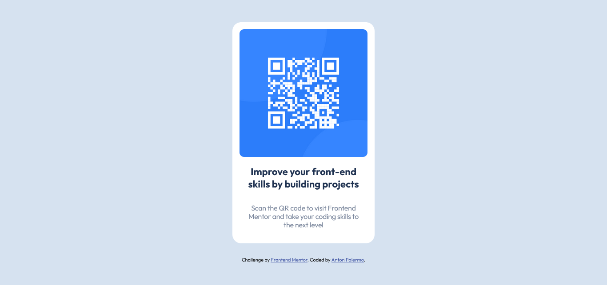

# Frontend Mentor - QR code component solution

This is a solution to the [QR code component challenge on Frontend Mentor](https://www.frontendmentor.io/challenges/qr-code-component-iux_sIO_H). Frontend Mentor challenges help you improve your coding skills by building realistic projects.

## Table of contents

- [Overview](#overview)
  - [Screenshot](#screenshot)
  - [Links](#links)
- [My process](#my-process)
  - [Built with](#built-with)
  - [What I learned](#what-i-learned)
  - [Continued development](#continued-development)
- [Author](#author)

## Overview

### Screenshot



Welcome friends! This repo contains solution for my [Frontend Mentor](https://www.frontendmentor.io/) QR Code Component. You can view the solution and live site on the links provided below.

### Links

- Solution URL: [https://www.frontendmentor.io/solutions/qr-code-component-467EcWEtSN](https://www.frontendmentor.io/solutions/qr-code-component-467EcWEtSN)
- Live Site URL: [https://qr-component-dun.vercel.app/](https://qr-component-dun.vercel.app/)

## My process

### Built with

- CSS custom properties
- Flexbox
- Mobile-first workflow
- [React](https://reactjs.org/) - JS library
- [ViteJS](https://vitejs.dev/) - React framework

### What I learned

I just learn how to create a react app using [ViteJS](https://vitejs.dev/), awesome tool. In combination with vanila css to achieved the challange styles. I strugle a bit on how to center the component on the page and the flexbox saved me a good amount of time.

```
.center {
  display: flex;
  flex-direction: column;
  align-items: center;
  justify-content: center;
}
```

### Continued development

I'm planning to replace the css with tailwind but I think that's a bit of an overkill for a simple project.

## Author

- Frontend Mentor - [@antonpalermo](https://www.frontendmentor.io/profile/antonpalermo)
- Twitter - [@iamantonangelo](https://www.twitter.com/iamantonangelo)
